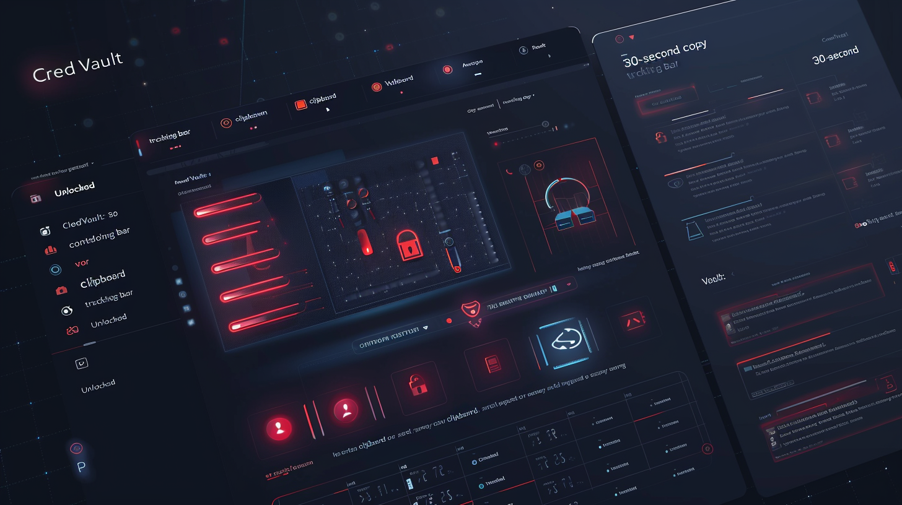
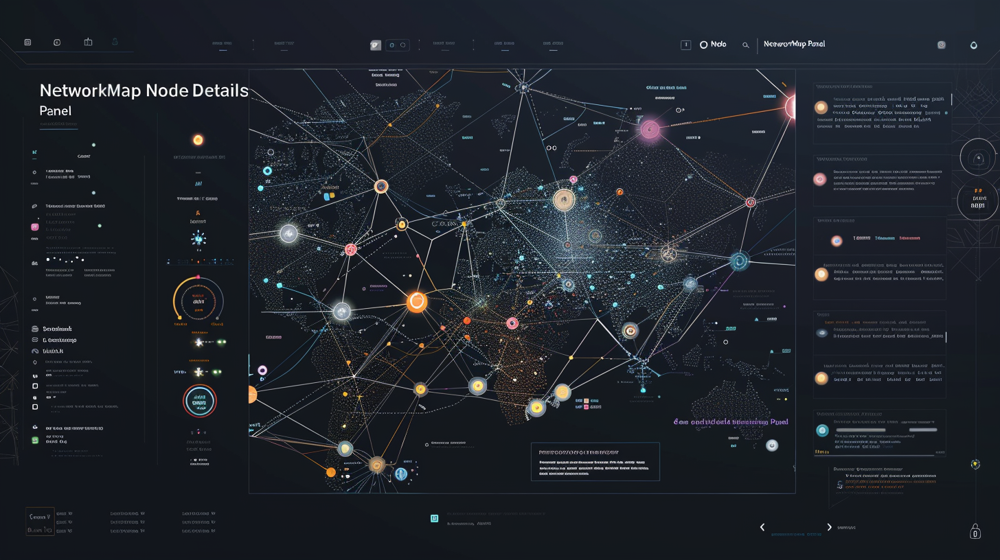

# CyberOS

A personal desktop ecosystem for cybersecurity work — a suite of **13 Electron applications** that share one communication layer, one design language, and one Obsidian knowledge vault. Together they cover the full loop of an authorised security engagement: intelligence, target tracking, methodology, live testing, evidence capture, knowledge management, and reporting.

Each app owns one domain and runs independently — any can be closed without breaking the others. They coordinate entirely through shared files on disk (no servers, no sockets).

> ⚠️ **Authorised use only.** These tools are for lawful, authorised security testing, study, and personal knowledge management. Use them only against systems you own or have explicit written permission to test.

---

## The apps

| App | What it does |
|---|---|
| **Cybertools Launcher** | System-tray hub — launches and monitors every app |
| **CyberOS Dashboard** | Live ecosystem status, activity feed, operator profile |
| **CyberLab Companion** | AI-assisted lab companion (HTB/THM/CTF) — chat, commands, encoders, writeups |
| **ReconDesk** | Target & attack-surface tracker — ports, creds, attack board, CVSS |
| **GhostVault** | Obsidian-connected note capture & Markdown editor |
| **VaultCore** | Knowledge scraper + vault health + git/secret tooling |
| **SignalBoard** | Security intelligence feed aggregator with relevance scoring |
| **PlaybookStudio** | Build, run, and track methodology playbooks (OWASP, AD, CCNA…) |
| **CredVault** | Encrypted credential & secret manager |
| **ReportForge** | Professional assessment report generator |
| **TerminalLink** | Embedded terminal with command logging & session replay |
| **NetworkMap** | Visual network topology mapper (nmap import) |
| **NetLab** | Networking lab & study workspace |

Design tokens and UI conventions: see **[`CYBEROS_DESIGN_BIBLE.md`](./CYBEROS_DESIGN_BIBLE.md)**.
Change history and per-app status notes live under [`docs/`](./docs).

---

## Screenshots

Design mockups for the ecosystem live in [`Cyber-Mockups/`](./Cyber-Mockups). A few:

| Dashboard | CredVault | NetworkMap |
|---|---|---|
|  |  |  |

> These are high-fidelity design mockups. Live-app captures are pending.

---

## Stack

Electron 33 · electron-vite 2.x · React 18 · TypeScript 5 · Tailwind CSS 3 · Framer Motion 11 · Zustand 4.

---

## Running an app

Each app is a standalone `electron-vite` project. There is no root build — work inside the app folder you want:

```bash
cd "ReconDesk"        # or any app folder
npm install
npm run dev           # launch in development
```

Build a distributable:

```bash
npm run build         # or: npm run build:mac / build:win / build:linux
npm run typecheck     # type-check only
```

> **Build note:** the ESM apps (those with `"type": "module"`) require `output: { format: 'cjs' }` in the preload config and a `preload.cjs` reference. Without it, electron-vite emits `.mjs`, which the Electron sandbox can't load and the app won't start. If an app fails to launch, check this first.

---

## How the apps coordinate

- **`~/cybertools-config.json`** — each app writes its own `<app>_status` block and `execPath`; shared objects (`shared_context`, `operator_profile`, `credvault_pending`) flow between apps here.
- **`ecosystem-events.json`** — an append-only event bus the Dashboard watches for the live activity feed.
- **The Obsidian vault** — GhostVault, VaultCore, SignalBoard, CyberLab, and ReportForge all write Markdown into one shared vault.

---

## Configuration

The apps require **no application secrets or `.env` file**. Runtime configuration is
read from OS-standard locations only (`NODE_ENV`, `PATH`, and platform config/data
dirs — `APPDATA`/`LOCALAPPDATA` on Windows, `XDG_CONFIG_HOME`/`XDG_DATA_HOME` on
Linux). Cross-app state is coordinated through the shared files described above
(`~/cybertools-config.json`, `ecosystem-events.json`, and the Obsidian vault).

Encrypted local artifacts (`vault.enc`, `apikey.enc`, `*.cyberos-backup`, etc.) are
generated at runtime by the apps and are deliberately excluded from version control
via [`.gitignore`](./.gitignore) — never commit them.

---

## Project status & roadmap

- **Active development.** All 13 apps have working `electron-vite` scaffolds; feature
  completeness varies by app (CyberOS Dashboard is at v2, most others at v1).
- **UI convergence in progress.** A large body of `ui/*` branches migrate individual
  apps to a shared shadcn-based component system; not yet merged to `main`.
- **Known issue (2026-06):** some apps hit a Rollup preload-rename bug on launch —
  see the build note above and `fix/boot-cyberos-2026-06-10`.

---

## License

Released under the [MIT License](./LICENSE) © 2026 Cody Liddell.

---

*ItsEliias // CyberOS*
